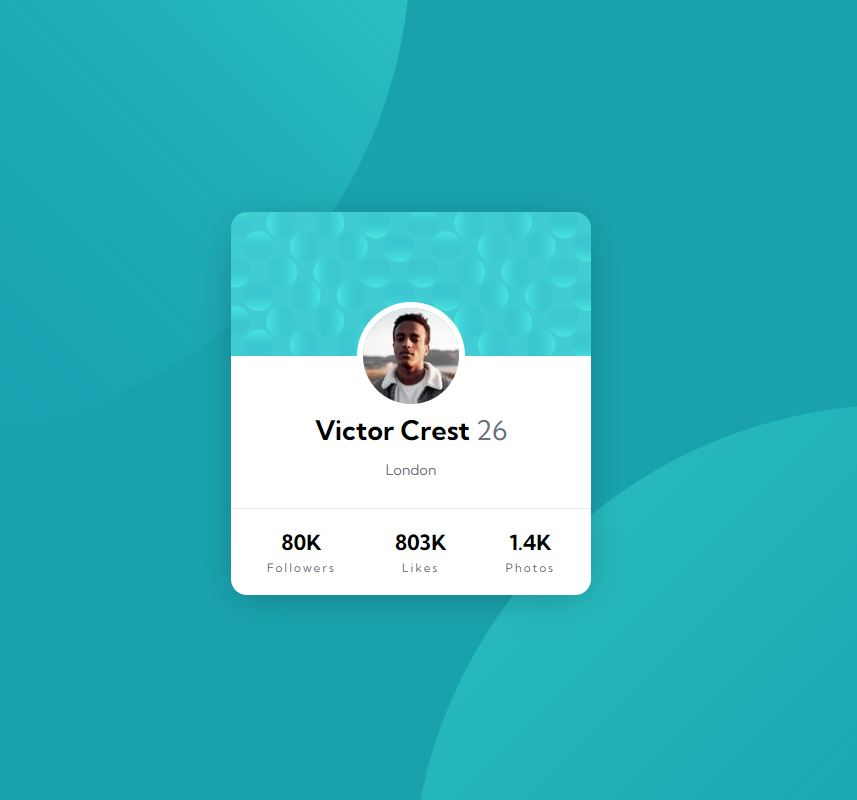

# Frontend Mentor - Profile card component solution

This is a solution to the [Profile card component challenge on Frontend Mentor](https://www.frontendmentor.io/challenges/profile-card-component-cfArpWshJ). Frontend Mentor challenges help you improve your coding skills by building realistic projects.

## Table of contents

- [Overview](#overview)
  - [The challenge](#the-challenge)
  - [Screenshot](#screenshot)
  - [Links](#links)
- [My process](#my-process)
  - [Built with](#built-with)
  - [Continued development](#continued-development)
- [Author](#author)
- [Acknowledgments](#acknowledgments)

## Overview

### The challenge

- Build out the project to the designs provided

### Screenshot

### Links

- Solution URL: [https://github.com/Robert-Rynard/profile-card-component-main](https://github.com/Robert-Rynard/profile-card-component-main)
- Live Site URL: [https://robert-rynard.github.io/profile-card-component-main/](https://robert-rynard.github.io/profile-card-component-main/)

## My process

### Built with

- CSS custom properties
- Flexbox

### Continued development

This challenge I struggled with setting the background svgs to be in the correct place on all screen sizes. I ended up looking to someone elses solution for better understanding on how to resolve this issue. By review another solution I came to realize that I was using vw and vh on the wrong position causing it to not respond correctly. Going forward I would like to gain more confidence in using vh and vw units to create more responsive design.

## Author

- Website - [Robert Rynard](https://github.com/Robert-Rynard)
- Frontend Mentor - [@Robert-Rynard](https://www.frontendmentor.io/profile/Robert-Rynard)
- Twitter - [@robert_rynard](https://www.twitter.com/robert_rynard)

## Acknowledgments

The linked [Solution](https://dev.to/lismaria/profile-card-challenge-frontendmentor-io-3d51) by lismaria was where I was able to review their solution and find better understanding on how to use vw and vh to create more responsive sites.
